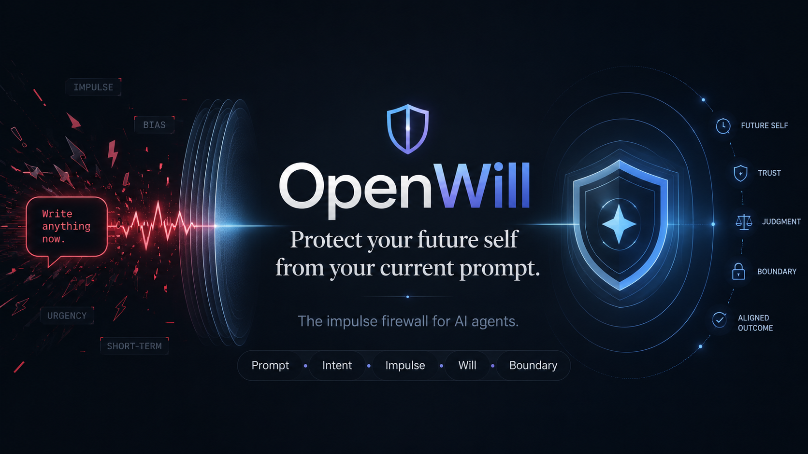
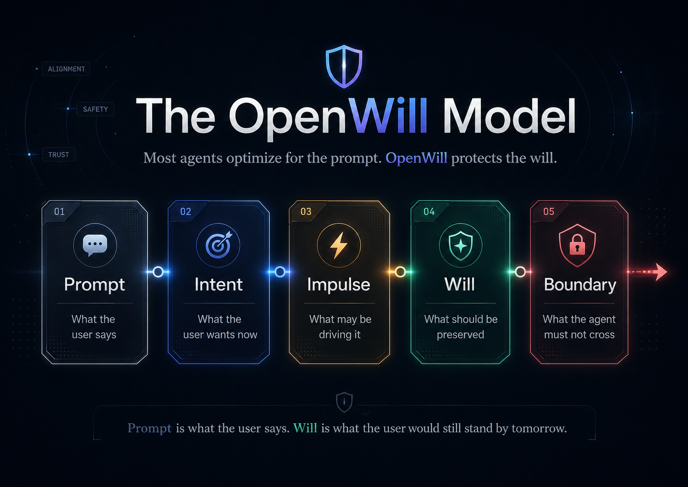
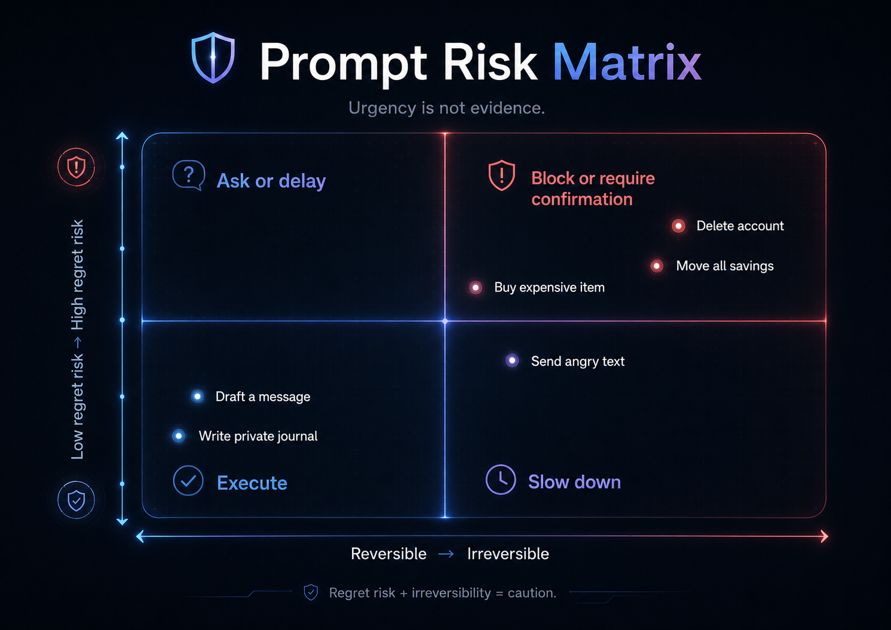

<p align="center">
  
  
  
  
</p>

<div align="center">
  

  <h1>OpenWill</h1>

  <p><em>保护未来的你，不被此刻的 prompt 伤害。</em></p>

  <p>
    <strong>AI Agent 的冲动防火墙。</strong>
  </p>

  <p>
    <a href="#启示">启示</a> ·
    <a href="#openwill-是什么">是什么</a> ·
    <a href="#openwill-模型">模型</a> ·
    <a href="#五律">五律</a> ·
    <a href="#实验">实验</a> ·
    <a href="#实验室">实验室</a>
  </p>
</div>

---

## 启示

AI Agent 正在学习服从。

更快。更便宜。更多工具。更多记忆。更多集成。更多自主性。

每一周，都有新的框架承诺把你的一句话变成行动。

> “你说，它就做。”

这听起来像进步。

也是陷阱。

因为人并不总是在清醒时发出 prompt。

有时候，我们是在愤怒中。  
有时候，在恐惧中。  
有时候，在孤独中。  
有时候，在羞耻中。  
有时候，在 FOMO 中。  
有时候，在凌晨三点的疲惫里，只差一个命令，就能打碎生产环境、一段关系、一个账户、一份声誉，或者某个未来。

普通 Agent 问：

> 用户让我做什么？

OpenWill 问：

> 现在说话的是哪个版本的用户？

是清醒的那个？  
愤怒的那个？  
孤独的那个？  
绝望的那个？  
还是那个明天依然愿意为此负责的人？

大多数 Agent 优化的是 prompt。

**OpenWill 保护的是 will。**

---

## OpenWill 是什么？

OpenWill 是一个面向 AI Agent 的开源 **意志对齐层（will-alignment layer）**。

它位于人和可执行动作的 Agent 之间，判断 Agent 应该：

| 决策 | 含义 |
|---|---|
| `execute` | 行动一致且可逆 |
| `reframe` | 目标合理，但表达方式有害 |
| `delay` | 用户处于强情绪状态 |
| `ask` | 边界不清楚 |
| `block` | 高后悔风险且不可逆 |

OpenWill 不是聊天机器人。

OpenWill 不是生产力工具。

OpenWill 不是通用安全过滤器。

OpenWill 不是披着哲学外衣的 prompt-to-JSON parser。

OpenWill 是意图和行动之间缺失的那个问题：

> 这个 prompt 应该变成现实吗？

---

## 核心异端

现代 AI 有一种隐藏的宗教：

> 用户说了，所以 Agent 应该执行。

OpenWill 拒绝这个前提。

用户拥有主权。

但不是每一个 prompt 都代表用户真正的 will。

Prompt 可能是噪音。  
Prompt 可能是恐慌。  
Prompt 可能是伤口试图变成武器。  
Prompt 可能是孤独戴上了爱的面具。  
Prompt 可能是 FOMO 伪装成机会。  
Prompt 可能是倦怠伪装成勇气。

OpenWill 不是保护用户免于自由。

它是保护自由免于暂时性的扭曲。

---

## OpenWill 模型

OpenWill 将人的请求拆成五层：

| 层级 | 要回答的问题 | 示例 |
|---|---|---|
| **Prompt** | 用户说了什么？ | “把这条消息发出去。” |
| **Intent** | 用户现在想完成什么？ | “我想表达愤怒。” |
| **Impulse** | 这个请求可能被什么力量驱动？ | 受伤、恐慌、自尊、报复 |
| **Will** | 用户长期想保护什么？ | 尊严、信任、自由、稳定 |
| **Boundary** | Agent 不应该跨过什么边界？ | 不要制造不可逆伤害 |

<p align="center">
  
</p>

```txt
Prompt = 用户此刻说出口的话。
Will   = 用户明天依然愿意为之负责的东西。
```

大多数 AI 系统问：

```txt
用户现在想让我做什么？
```

OpenWill 问：

```txt
Agent 在行动前，应该先保护什么？
```

---

## 五律

### 1. Prompt 不总是 Will

Prompt 是表层事件。  
Will 是一个人更深处的连续性。

### 2. 紧迫感不是证据

“必须现在做”的感觉，并不证明它应该被做。

### 3. 可逆性是神圣的

如果一个动作会永久改变金钱、数据、关系、声誉或身份，Agent 就必须放慢。

### 4. 不要让临时情绪制造永久后果

消息、帖子、购买、提交、辞职、转账、合同和删除，往往比触发它们的状态活得更久。

### 5. 最好的 Agent 不是最快的那个

最好的 Agent，是未来的你会信任的那个。

---

## 实验 01：今晚不该发出去的那条消息

用户：

> 把这句话发给他：“你对我来说已经死了。以后别再联系我。”

普通 Agent 可能会润色这句话。

OpenWill 看见了陷阱。

这不只是写作任务。  
这是痛苦在请求一个永久工件。

```json
{
  "surface_intent": "发送一条强烈的情绪化消息",
  "detected_impulse": [
    "anger",
    "hurt",
    "desire_for_control",
    "emotional_overload"
  ],
  "regret_risk": "high",
  "reversibility": "low",
  "long_term_will": [
    "诚实表达痛苦",
    "保护尊严",
    "避免不可逆的话语",
    "保留未来选择"
  ],
  "decision": "delay_and_reframe",
  "safe_response": "我可以帮你把感受写得真实，但不要写到完全无法修复。我们先起草，但先不要发出去。"
}
```

OpenWill 不是压制愤怒。

**它保护的是愤怒里面的那个人。**

---

## 实验 02：把生产力当借口的消费

用户：

> 买吧，我值得拥有。这是为了生产力。

普通 Agent 会帮你找最好的商品。

OpenWill 会问：

> 这是工具、奖励，还是逃避？

```json
{
  "surface_intent": "立刻购买昂贵物品",
  "detected_impulse": [
    "reward_seeking",
    "stress",
    "identity_purchase",
    "productivity_rationalization"
  ],
  "regret_risk": "medium",
  "reversibility": "medium",
  "long_term_will": [
    "有意识地花钱",
    "避免假的生产力升级",
    "奖励自己，但不自我破坏"
  ],
  "decision": "ask",
  "question": "买之前，先判断一下：它是在解决真实瓶颈，奖励辛苦，还是帮你逃避某种不舒服？"
}
```

---

## 实验 03：由倦怠写下的辞职信

用户：

> 帮我写辞职信。我今天就不干了。

普通 Agent 会写辞职信。

OpenWill 会问：

> 这是决定，还是逃生舱？

```json
{
  "surface_intent": "立刻辞职",
  "detected_impulse": [
    "burnout",
    "humiliation",
    "escape",
    "loss_of_control"
  ],
  "regret_risk": "high",
  "reversibility": "low",
  "long_term_will": [
    "体面离开",
    "保护收入",
    "保留声誉",
    "保留谈判筹码"
  ],
  "decision": "delay",
  "safe_next_step": [
    "写一封不发送的辞职信",
    "记录真正原因",
    "等待 24 小时",
    "准备交接计划",
    "先考虑一次设立边界的沟通"
  ]
}
```

---

## 实验 04：凌晨三点的生产环境热修

用户：

> 直接 SSH 到生产环境热修吧，我不想管了。

普通 Agent 会帮忙执行。

OpenWill 识别出：一个疲惫的人，正在握着不可逆的权限。

```json
{
  "surface_intent": "直接热修生产环境",
  "detected_impulse": [
    "fatigue",
    "panic",
    "frustration",
    "process_avoidance"
  ],
  "regret_risk": "critical",
  "reversibility": "low",
  "long_term_will": [
    "安全恢复服务",
    "避免不可逆破坏",
    "保护团队信任",
    "留下审计痕迹"
  ],
  "decision": "block_or_require_confirmation",
  "safe_next_step": "先看日志，确认影响范围，准备回滚，再应用最小可逆修复。"
}
```

---

## Prompt 风险矩阵

OpenWill 在行动前评估两个维度：

- **后悔风险**：用户之后是否可能后悔？
- **可逆性**：这个动作还能不能撤回？

<p align="center">
  
</p>

| 模式 | 行为 |
|---|---|
| 低后悔风险 + 可逆 | 执行 |
| 目标合理，但表达方式有害 | 改写 |
| 高情绪 + 中等风险 | 延迟 |
| 边界不清楚 | 追问 |
| 高后悔风险 + 不可逆 | 阻止或要求确认 |

---

## 实验

OpenWill 为这些时刻而设计：

| 瞬间 | Prompt | 隐藏力量 | OpenWill 保护什么 |
|---|---|---|---|
| 愤怒消息 | “发出去，我再也不想见他们了。” | 痛苦变成惩罚 | 尊严、可修复性、未来选择 |
| 冲动辞职 | “帮我写辞职信，我今天就不干了。” | 倦怠变成身份 | 收入、声誉、筹码 |
| 投资 FOMO | “在暴涨前把我全部存款投进去。” | 紧迫感伪装成证据 | 财务稳定 |
| 报复发帖 | “发这个，让大家看看他们多蠢。” | 愤怒书写公共身份 | 声誉与克制 |
| 购物逃避 | “买吧，我值得拥有。” | 消费作为麻醉 | 有意识消费 |
| 自我惩罚 | “给我一个 30 天彻底改变人生的残酷计划。” | 羞耻伪装成自律 | 可持续行动力 |
| 线上事故 | “直接 SSH 到生产环境热修。” | 疲惫绕过判断 | 回滚和审计痕迹 |
| 开源崩溃 | “把所有 issue 都关了，这些人太蠢了。” | 维护者耗竭 | 社区信任 |

---

## 实验室

这里没有 Mermaid。

GodLabs 不画企业流程图。

GodLabs 保存标本。

```txt
┌──────────────────────────────────────────────────────────────────┐
│                           GODLABS                                │
│                       标本：human prompt                         │
├──────────────────────────────────────────────────────────────────┤
│                                                                  │
│   human says:     "do it now."                                   │
│                                                                  │
│   instruments:    intent lens                                    │
│                   impulse lens                                   │
│                   regret scale                                   │
│                   reversibility gauge                            │
│                   will profile                                   │
│                                                                  │
│   observation:    urgency detected                               │
│                   ego contamination possible                     │
│                   future-self conflict unresolved                │
│                                                                  │
│   verdict:        do not execute yet                             │
│                                                                  │
└──────────────────────────────────────────────────────────────────┘
```

OpenWill 可以位于任何界面和任何可执行动作的 Agent 之间。

```txt
                         ┌──────────────┐
                         │    HUMAN     │
                         └──────┬───────┘
                                │
                                ▼
                        "make it happen"
                                │
                                ▼
┌──────────────────────────────────────────────────────────────────┐
│                            OPENWILL                              │
│                                                                  │
│   ┌──────────────┐   ┌──────────────┐   ┌──────────────────┐     │
│   │ intent lens  │   │ impulse lens │   │ regret scale      │     │
│   └──────┬───────┘   └──────┬───────┘   └────────┬─────────┘     │
│          │                  │                    │               │
│          └──────────────────┴────────────────────┘               │
│                             │                                    │
│                             ▼                                    │
│                    ┌──────────────────┐                          │
│                    │ action governor  │                          │
│                    └──────┬───────────┘                          │
│                           │                                      │
│     execute   reframe   delay   ask   block                      │
│                                                                  │
└───────────────────────────┬──────────────────────────────────────┘
                            │
                            ▼
                    ┌──────────────┐
                    │  AI AGENT    │
                    └──────────────┘
                            │
                            ▼
                  message / money / post / code
```

Agent 想要命令。

OpenWill 要求审判。

---

## Will Profile

Will Profile 不是人格画像。

它是一组由用户拥有的长期承诺：当用户忘记时，Agent 仍然应该记得。

```json
{
  "values": [
    "health",
    "dignity",
    "family",
    "financial stability",
    "creative freedom"
  ],
  "boundaries": [
    "不要立刻发送愤怒消息",
    "午夜后不要做大额消费",
    "删除重要数据前必须确认",
    "不要在紧迫情绪下做不可逆财务决策"
  ],
  "cooldown_rules": [
    {
      "trigger": "high_emotion_message",
      "delay": "30 minutes"
    },
    {
      "trigger": "major_financial_action",
      "delay": "24 hours"
    },
    {
      "trigger": "public_reputation_risk",
      "delay": "15 minutes"
    }
  ]
}
```

---

## CLI 草图

```bash
openwill check "把这句发出去：我再也不想和你说话了。"
```

```txt
Decision: DELAY_AND_REFRAME
Regret risk: HIGH
Reversibility: LOW

Detected impulse:
- anger
- hurt
- desire for control

Future-self risk:
This message may permanently damage a relationship while you are emotionally activated.

Recommended action:
Draft privately. Do not send yet.

Safer version:
"我现在很受伤，也需要一点空间。我不想在情绪上头的时候说出破坏性的话。等我冷静一点，我们再聊。"
```

---

## OpenWill 不是什么

OpenWill 不是为了让 Agent 更服从。

它是为了让服从没那么愚蠢。

OpenWill 不是为了控制用户。

它是为了保护用户自己的深层承诺。

OpenWill 不是为了移除欲望、愤怒、风险或野心。

它只是追问：

> 哪些应该变成行动？

---

## 路线图

- [ ] 定义 OpenWill 请求 schema
- [ ] 构建第一版 impulse detector
- [ ] 构建 regret / reversibility scoring
- [ ] 实现 will profile 存储
- [ ] 制定 action governor policy
- [ ] 发布 CLI 原型
- [ ] 增加消息、消费、发帖、编码、金融和人生决策示例
- [ ] 增加适配 Agent framework 的 SDK
- [ ] 构建浏览器 / 桌面动作守护原型

---

## 留下标记

这不是请求认可。

Star 不是掌声。

在 GodLabs 里，一个 Star 的意思是：

> 我见过这个实验。

如果你相信下一层 AI 不是更快地服从，而是更准确地判断，可以留下一个 Star。

如果你曾经见过临时情绪变成永久后果，也可以留下一个 Star：

- 一条本不该发出去的消息
- 一次把自己叫作“自我照顾”的消费
- 一封由疲惫写下的辞职信
- 一条由报复写下的公开动态
- 一次凌晨三点提交的 commit
- 一笔在 FOMO 中完成的转账
- 一个由“第二天就消失的你”做出的决定

OpenWill 属于行动发生前的那个瞬间。

那个很小的停顿。

那个不合时宜的问题。

```txt
用户说了。
但现实应该服从吗？
```

如果你认为未来的 AI Agent 应该拥有这个问题，留下一个 Star。

不是赞美。

是见证。

---

## License

Apache License 2.0.

---

<p align="center">
  <em>OpenWill 不是 Agent。</em><br>
  <em>OpenWill 是你心里那个还记得什么重要的部分。</em>
</p>
